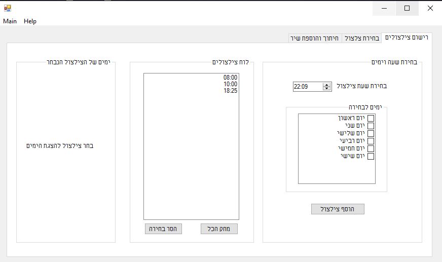

# BellClock
## Bell ringing schedule

This simple interface is made to replace the "old-school" machines that tell the system when to ring
All you do is choose an hour and click the button, choose the song and you'r done

## מדובר במערכת פשוטה המתאימה למחשב ווינדוס על מנת לעזור לבתי ספר ישנים להשמיע צילצולים של שירים ללא השקעה כספית משמעותית חדשה

# ScreenShots

